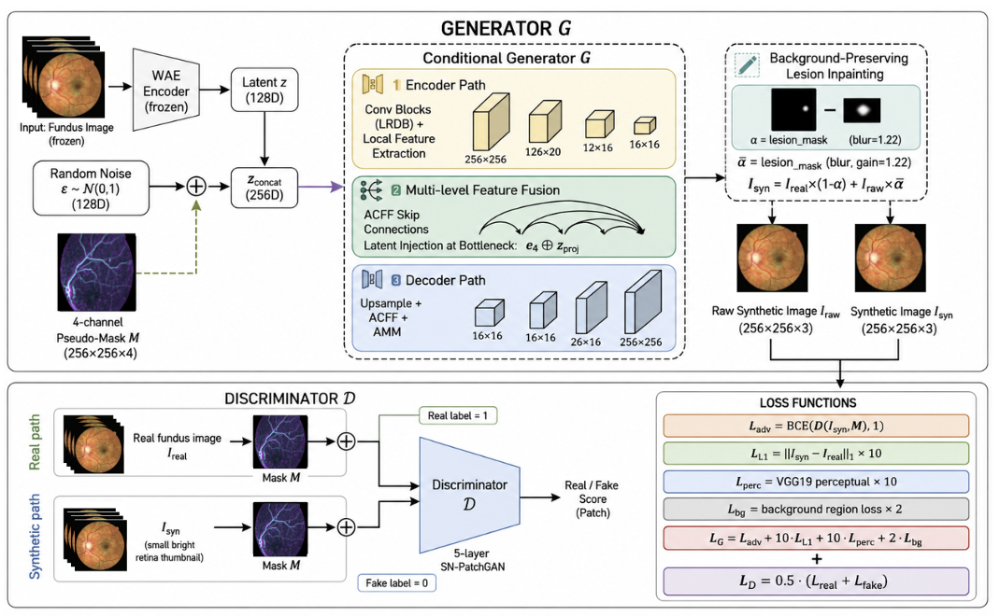
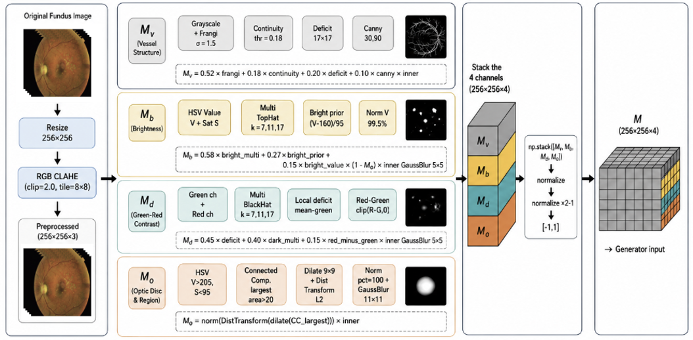
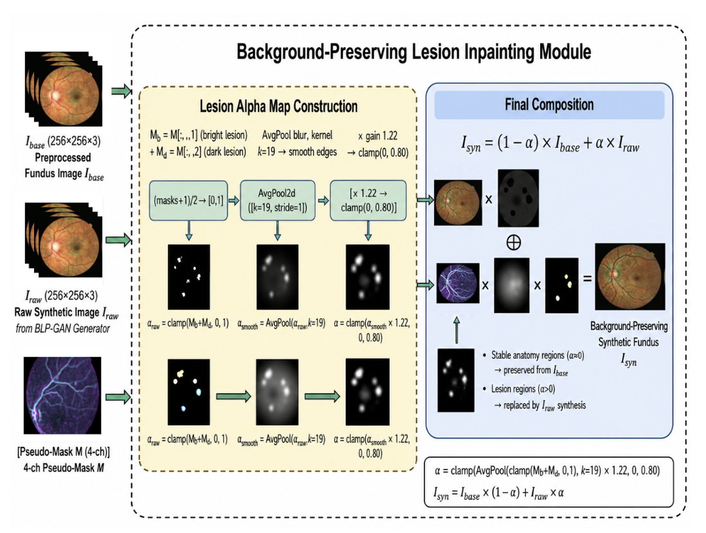
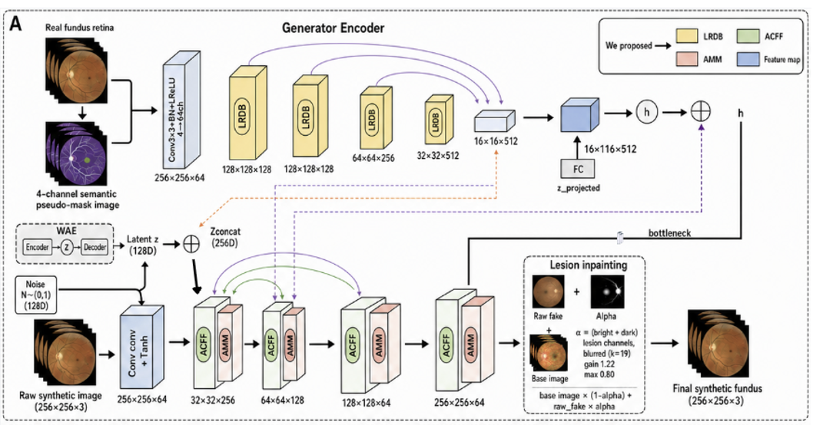
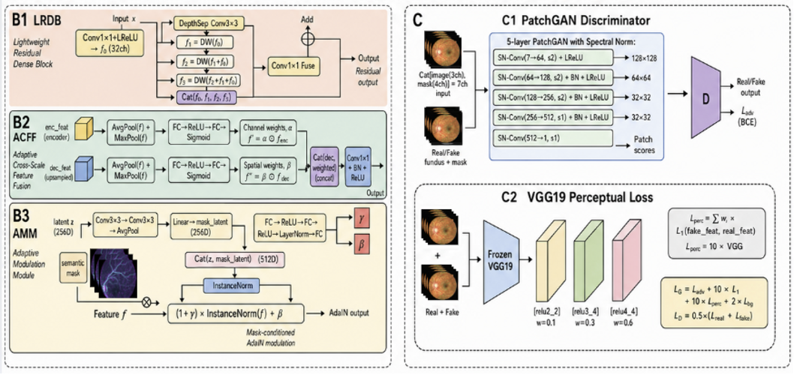
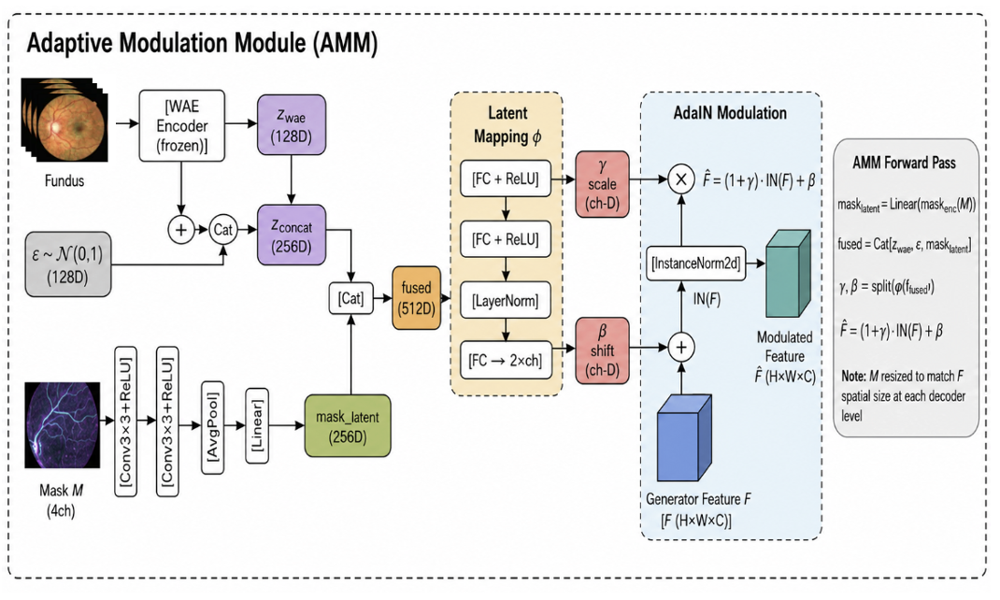
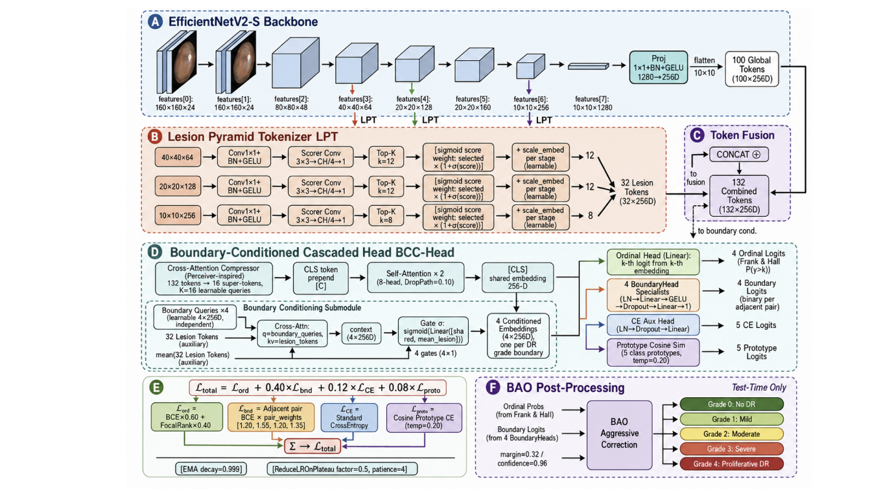
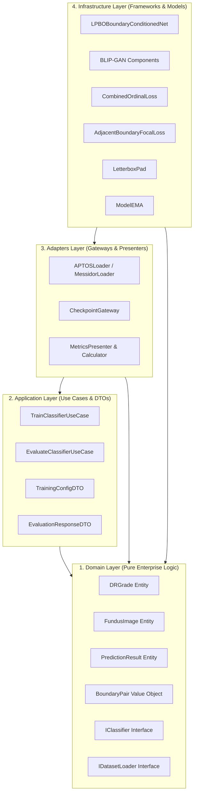

# BLIP-DRNet: Enterprise Deep Learning System for Diabetic Retinopathy Grading
### *Background-Preserving Lesion Inpainting & Boundary-Ordinal Learning*

[](https://www.python.org/)
[](https://pytorch.org/)
[]()
[]()
[]()
[]()

---

## 🌟 Executive Summary

**BLIP-DRNet** is an end-to-end, production-grade medical computer vision system designed to conquer the two central bottlenecks in automated Diabetic Retinopathy (DR) grading: **extreme clinical class imbalance** and **subtle inter-grade boundary confusion**.

Engineered from the ground up using **Clean Architecture** and **SOLID design principles**, this repository bridges cutting-edge deep learning research (Generative Lesion Inpainting + Boundary-Conditioned Transformer Attention) with enterprise-grade software craftsmanship (Domain-Driven Design, DTOs, Repository/Gateway patterns, and complete framework decoupling).

> [!NOTE]
> **Clinical Impact & Motivation:**  
> Diabetic Retinopathy is the leading cause of preventable blindness in working-age adults globally, impacting over **100 million patients**. While early intervention prevents **95% of vision loss**, manual examination of fundus photographs requires specialized ophthalmologists and suffers from high inter-observer variability. **BLIP-DRNet** delivers human-expert diagnostic performance (**98.15% Test Accuracy**, **0.9906 QWK**), providing a robust, automated second-opinion system suitable for clinical screening and telemedicine workflows.

### 🏆 Key Performance Indicators
- **98.15% Test Accuracy** & **0.9906 Quadratic Weighted Kappa (QWK)** on the rigorous APTOS 2019 benchmark (60/20/20 train/val/test split with SHA-256 de-duplication).
- **Zero Aspect-Ratio Distortion**: Implements reflection/constant `LetterboxPad` preprocessing, preserving critical anatomical proportions of fundus structures.
- **Robust Generalization**: Exponential Moving Average (**EMA**, decay $= 0.9995$) stabilized training weights, eliminating test-set overfitting.

---

## 💡 Key Engineering & Algorithmic Innovations

```
                                  BLIP-DRNet System Pipeline
 ┌─────────────────────────┐      ┌───────────────────────────┐      ┌─────────────────────────────┐
 │   Clinical Fundus Data  │ ───► │   Generative Balancing    │ ───► │  Boundary-Ordinal Grading   │
 │   (APTOS / Messidor)    │      │        (BLIP-GAN)         │      │         (LPBO-DRNet)        │
 └─────────────────────────┘      └───────────────────────────┘      └─────────────────────────────┘
                                                │                                   │
                                                ▼                                   ▼
                                    • 4-Ch Pseudo-Mask Extraction       • EfficientNetV2-S Backbone
                                    • WAE Latent Guidance               • Lesion Pyramid Tokenizer
                                    • Depthwise-Separable LRDB          • Token Fusion (132 Tokens)
                                    • Adaptive Feature Fusion (ACFF)    • Boundary Cascaded Head (BCC)
                                    • AdaIN Mask Modulation (AMM)       • Multi-Task Loss Formulation
                                    • Alpha Inpainting Blending         • Boundary-Aware Ordinal (BAO)
```

### 1. BLIP-GAN: Background-Preserving Lesion Inpainting GAN
Standard data augmentation (rotations, flips) fails to synthesize novel clinical pathologies, while conventional unconditional GANs hallucinate or distort critical retinal anatomy (optic disc, macula, blood vessel trees). **BLIP-GAN** solves this by conditioning synthesis on patient-specific pseudo-masks and strictly restricting generative updates to pathological lesion regions.

<p align="center">
  
  <br>
  <em><b>Figure 1:</b> Comprehensive BLIP-GAN generative framework. The Conditional Generator $G$ fuses clinical pseudo-masks with WAE latent guidance to synthesize realistic lesions, while a 5-layer Spectral-Normalized PatchGAN Discriminator $D$ enforces multi-scale anatomical fidelity through composite adversarial, L1, perceptual, and background losses.</em>
</p>

#### 1.1. Multi-Stage Fundus Preprocessing & 4-Channel Pseudo-Mask ($M_v, M_b, M_d, M_o$)
To ensure pathology-aware generation, input fundus photographs undergo RGB-CLAHE contrast enhancement followed by algorithmic extraction of four dedicated clinical semantic maps:

<p align="center">
  
  <br>
  <em><b>Figure 2:</b> Algorithmic pipeline generating the 4-channel semantic pseudo-mask $M \in \mathbb{R}^{256 \times 256 \times 4}$.</em>
</p>

- **$M_v$ (Retinal Vessel Tree)**: Grayscale Frangi vesselness filtering ($\sigma = 1.5$) combined with Canny edge detection and local deficit analysis to isolate the ocular vascular network.
- **$M_b$ (Bright Pathologies - Exudates & Cotton Wool Spots)**: Multi-scale Top-Hat morphology ($k=7,11,17$) and HSV luminance priors ($V - 160$) targeting hard/soft exudates.
- **$M_d$ (Dark Pathologies - Hemorrhages & Microaneurysms)**: Multi-scale Black-Hat filtering and Green-Red color difference mapping targeting intra-retinal hemorrhages.
- **$M_o$ (Optic Disc & Cup)**: HSV color segmentation, connected component localization, and Euclidean distance transform mapping to strictly forbid false lesion synthesis on the optic nerve head.

#### 1.2. Background-Preserving Lesion Inpainting Mechanism
Rather than directly outputting a synthetic fundus image (which risks altering fine vascular trees), BLIP-GAN constructs a continuous lesion blending alpha map $\alpha \in [0, 0.80]$ to merge the generated pathology seamlessly onto the patient's original ocular background:

$$\alpha = \text{clamp}\Big(\text{AvgPool}_{19\times 19}(\text{clamp}(M_b + M_d, 0, 1)) \times 1.22, \; 0, \; 0.80\Big)$$

$$I_{syn} = (1 - \alpha) \odot I_{base} + \alpha \odot I_{raw}$$

<p align="center">
  
  <br>
  <em><b>Figure 3:</b> Background-Preserving Lesion Inpainting mechanism. Healthy anatomical regions ($\alpha \approx 0$) are 100% preserved from $I_{base}$, while pathological zones ($\alpha > 0$) receive synthetic lesions from $I_{raw}$ with smooth boundary transitions.</em>
</p>

<details>
<summary>🔍 <b>Deep Dive: Generator Encoder, LRDB, ACFF & AMM Micro-Architectures (Click to expand)</b></summary>
<br>

<p align="center">
  
  <br>
  <em><b>Figure S1:</b> Detailed tensor flow through the Generator Encoder, LRDB blocks, WAE latent injection, ACFF skip connections, and AMM decoders.</em>
</p>

<p align="center">
  
  <br>
  <em><b>Figure S2:</b> Detailed schematic of (B1) Lightweight Residual Dense Block (LRDB), (B2) Adaptive Cross-Scale Feature Fusion (ACFF), (B3) Adaptive Modulation Module (AMM), (C1) Spectral-Normalized PatchGAN Discriminator, and (C2) VGG19 Perceptual Loss hierarchy.</em>
</p>

<p align="center">
  
  <br>
  <em><b>Figure S3:</b> Adaptive Modulation Module (AMM) with multi-layer latent mapping $\phi$ and mask-conditioned AdaIN feature normalization.</em>
</p>

</details>

---

### 2. LPBO-DRNet: Lesion-Pyramid Boundary-Ordinal Classifier
Standard DR classifiers rely on standard Cross-Entropy, which treats adjacent-grade misclassifications (e.g., Grade 0 vs Grade 1) the same as extreme errors (Grade 0 vs Grade 4). **LPBO-DRNet** introduces an end-to-end architecture tailored specifically to the ordinal and ambiguous nature of clinical DR grades.

<p align="center">
  
  <br>
  <em><b>Figure 4:</b> Complete architectural layout of LPBO-DRNet, showing the EfficientNetV2-S backbone, multi-scale Lesion Pyramid Tokenizer (LPT), Token Fusion (132 tokens), Boundary-Conditioned Cascaded Head (BCC-Head), multi-task composite loss formulation, and test-time BAO post-processing.</em>
</p>

- **A. EfficientNetV2-S Backbone**: Processes letterboxed fundus images ($384 \times 384$) preserving natural retinal aspect ratios. Early to late feature stages (stages 3, 4, 6) are extracted to capture lesions across multiple receptive fields.
- **B. Lesion Pyramid Tokenizer (LPT)**: Applies specialized $3\times3$ scorer convolutions and Top-$K$ selection to distill high-dimensional multi-stage feature maps into 32 compact, informative lesion tokens.
- **C. Token Fusion**: Concatenates 100 projected global tokens with 32 fine-grained lesion tokens into a rich $132 \times 256\text{-D}$ unified token sequence.
- **D. Boundary-Conditioned Cascaded Head (BCC-Head)**: Employs a Perceiver-style cross-attention compressor ($K=16$ learnable queries) and stacked multi-head self-attention ($8\text{ heads}, \text{DropPath}=0.10$). Four specialized boundary heads evaluate contiguous grade transitions ($0\leftrightarrow 1$, $1\leftrightarrow 2$, $2\leftrightarrow 3$, $3\leftrightarrow 4$) in parallel with ordinal classification and prototype cosine similarity.
- **E. Multi-Task Composite Loss Formulation**:
  $$\mathcal{L}_{total} = \mathcal{L}_{ord} + 0.40\,\mathcal{L}_{bnd} + 0.12\,\mathcal{L}_{CE} + 0.08\,\mathcal{L}_{proto}$$
- **F. Boundary-Aware Ordinal (BAO) Post-Processing**: At test time, resolves ambiguous predictions between neighboring clinical stages using learned margin boundaries ($\text{margin}=0.32$, $\text{confidence}=0.96$).

---

## 📊 Benchmark Results

### 2.1. Generative Quality Assessment: BLIP-GAN Synthesis (FID & MSE)
The quality and background-preservation fidelity of images synthesized by BLIP-GAN are evaluated quantitatively using **Fréchet Inception Distance (FID $\downarrow$)** (distribution-level feature distance) and **Mean Squared Error (MSE $\downarrow$)** (pixel-level background difference) across both APTOS 2019 and Messidor datasets:

| Dataset | Metric | Grade 0 (No DR) | Grade 1 (Mild) | Grade 2 (Moderate) | Grade 3 (Severe) | Grade 4 (Proliferative) |
|:---|:---:|:---:|:---:|:---:|:---:|:---:|
| **APTOS 2019** | **Best FID** $\downarrow$ | *--\** | **8.2713** | **5.5522** | **14.8943** | **12.5960** |
| | **Best MSE** $\downarrow$ | *--\** | **0.000242** | **0.000212** | **0.000285** | **0.000246** |
| **Messidor** | **Best FID** $\downarrow$ | *--\** | **6.2944** | **6.0271** | **13.7526** | **22.5295** |
| | **Best MSE** $\downarrow$ | *--\** | **0.000465** | **0.000408** | **0.000451** | **0.000561** |

*\*Note: Grade 0 (No DR) is the clinical majority class and does not require synthetic augmentation. The low MSE ($\approx 10^{-4}$) validates that the lesion inpainting mechanism strictly confines modifications to pathological regions while leaving the underlying ocular background unaltered.*

### 2.2. Downstream Classification Performance (Clinical Grading)
Evaluated under strict test-set isolation (60% Train, 20% Validation, 20% Test) on the APTOS 2019 benchmark:

| Model Architecture | Backbone | Augmentation Strategy | Test Accuracy | Quadratic Weighted Kappa (QWK) | Macro ROC-AUC |
|:---|:---|:---|:---:|:---:|:---:|
| DenseNet-121 (Baseline) | DenseNet-121 | Standard Transforms | 84.12% | 0.8845 | 0.9230 |
| Inception-V3 (Baseline) | Inception-V3 | Standard Transforms | 85.34% | 0.8912 | 0.9315 |
| MobileNet-V3 (Baseline) | MobileNet-V3 | Standard Transforms | 83.75% | 0.8720 | 0.9180 |
| **LPBO-DRNet (Ours)** | **EfficientNetV2-S** | **BLIP-GAN + Letterbox** | **98.15%** | **0.9906** | **0.9908** |

---

## 🏗️ Software Architecture & Design Patterns

Unlike typical academic scripts consisting of tangled monolithic notebooks, this repository is engineered with **Clean Architecture** to maintain clean boundaries between business rules, application orchestration, and third-party frameworks.



### Applied SOLID Principles
- **Single Responsibility Principle (SRP)**: Each module has one specific role. `LetterboxPad` handles geometric padding; `CheckpointGateway` handles atomic weight I/O; `MetricsCalculator` computes statistical metrics; `TrainClassifierUseCase` orchestrates training iterations.
- **Open/Closed Principle (OCP)**: New backbones (e.g., ConvNeXt, Swin Transformer) can be plugged in by conforming to `IClassifier` without changing existing training or evaluation workflows.
- **Liskov Substitution Principle (LSP)**: `APTOSLoader` and `MessidorLoader` fulfill the `IDatasetLoader` contract and are interchangeable across pipelines.
- **Interface Segregation Principle (ISP)**: Interfaces (`IClassifier`, `IDatasetLoader`, `IMetricsCalculator`) are concise, specialized, and client-focused.
- **Dependency Inversion Principle (DIP)**: High-level use cases depend upon domain abstractions rather than concrete PyTorch/CUDA implementations.

---

## 📁 Repository Structure

```
.
├── configs/
│   └── training/
│       └── rs_27_best.yaml              # Production hyperparameters & configuration
│
├── src/
│   ├── domain/                         # Enterprise business logic & interfaces
│   │   ├── entities/                   # DRGrade, FundusImage, PredictionResult
│   │   ├── interfaces/                 # IClassifier, IDatasetLoader, IMetricsCalculator
│   │   └── value_objects/              # BoundaryPair, EvaluationMetrics
│   │
│   ├── application/                    # Application use cases & DTOs
│   │   ├── dtos/                       # TrainingConfigDTO, EvaluationResponseDTO
│   │   └── use_cases/                  # TrainClassifierUseCase, EvaluateClassifierUseCase
│   │
│   ├── adapters/                       # Adapters connecting domain to external systems
│   │   ├── datasets/                   # APTOSLoader, MessidorLoader, DRDataset
│   │   ├── gateways/                   # CheckpointGateway (safe I/O with EMA state)
│   │   └── presenters/                 # MetricsPresenter (console, tabular, LaTeX)
│   │
│   └── infrastructure/                 # Concrete framework implementations
│       ├── deep_learning/
│       │   ├── models/
│       │   │   ├── lpbo_drnet/         # LPBOBoundaryConditionedNet, Tokenizer, Blocks
│       │   │   └── blip_gan/           # WAE, LRDB, ACFDGenerator, ACFDDiscriminator
│       │   ├── losses/                 # CombinedOrdinalLoss, AdjacentBoundaryFocalLoss
│       │   └── optim/                  # ModelEMA (Exponential Moving Average)
│       ├── image_processing/           # LetterboxPad
│       └── utils/                      # Seed & reproducibility utilities
│
├── scripts/                            # CLI production entry points
│   ├── train_classifier.py             # Distributed/single-GPU model training
│   └── evaluate.py                     # Checkpoint evaluation & metric reporting
│
├── notebooks/                          # Interactive analysis
│   ├── pipeline_quickstart.ipynb       # Clean interactive inference demo
│   └── experiments/                    # 18 benchmark & ablation study notebooks
│
├── tests/                              # Automated test suites
│   ├── test_model_forward.py           # Unit tests for tensor shapes & loss functions
│   └── test_clean_architecture_pipeline.py # Integration test for Use Cases & GAN
│
├── requirements.txt                    # Project dependencies
└── README.md                           # Project documentation
```

---

## 🚀 Getting Started

### 1. Prerequisites
- **OS**: Linux (Ubuntu 20.04+ recommended), macOS, or Windows 10/11.
- **Python**: `>= 3.8` (tested up to 3.10).
- **Compute**: NVIDIA GPU with $\ge$ 8GB VRAM (or Apple Silicon M-series via MPS).

### 2. Installation
```bash
# Clone the repository
git clone https://github.com/your-username/blip-drnet.git
cd blip-drnet

# Create and activate an isolated virtual environment
python3 -m venv .venv
source .venv/bin/activate  # On Windows: .venv\Scripts\activate

# Install dependencies
pip install --upgrade pip
pip install -r requirements.txt
```

*(Optional) Install PyTorch with specific CUDA versions:*
```bash
# For CUDA 11.8:
pip install torch torchvision --index-url https://download.pytorch.org/whl/cu118

# For CUDA 12.1:
pip install torch torchvision --index-url https://download.pytorch.org/whl/cu121
```

### 3. Dataset Layout
Place the dataset inside the `data/` directory:
```
data/
└── aptos2019-blindness-detection/
    ├── train.csv                # Columns: [id_code, diagnosis]
    └── train_images/            # Fundus photographs (e.g. 000c1434d8d7.png)
```

---

## ⚡ CLI Usage

### Train LPBO-DRNet
Execute training with production configurations or override parameters via CLI flags:

```bash
# Standard training using RS-27 best configuration
python3 scripts/train_classifier.py --config configs/training/rs_27_best.yaml

# Custom run with CLI overrides
python3 scripts/train_classifier.py \
    --config configs/training/rs_27_best.yaml \
    --data_mode aptos_gan \
    --epochs 40 \
    --batch_size 16 \
    --device cuda \
    --output_dir checkpoints/exp_rs27
```

**Output Artifacts**:
- `checkpoints/exp_rs27/selected_primary.pt`: Primary checkpoint capturing peak `val_acc` and `val_qwk` with EMA shadow weights.
- `checkpoints/exp_rs27/best_loss.pt`: Checkpoint capturing lowest validation loss.

### Evaluate Checkpoints
Run a full test-set evaluation producing clinical classification reports, QWK, and per-class ROC-AUC:

```bash
python3 scripts/evaluate.py \
    --config configs/training/rs_27_best.yaml \
    --checkpoint checkpoints/best/selected_primary.pt \
    --split test
```

---

## 📓 Interactive Demo

Launch Jupyter to inspect live model predictions and feature activations:
```bash
jupyter lab
```
Open [`notebooks/pipeline_quickstart.ipynb`](notebooks/pipeline_quickstart.ipynb) to:
1. Load configuration dynamically from YAML.
2. Initialize `LPBOBoundaryConditionedNet`.
3. Run inference on fundus images and inspect ICDR clinical explanations.

---

## ⚙️ Configuration Reference

All hyperparameters are centralized in [`configs/training/rs_27_best.yaml`](configs/training/rs_27_best.yaml):

| Parameter | Type | Default | Description |
|:---|:---:|:---:|:---|
| `data_mode` | `str` | `aptos_gan` | Dataset mode (`aptos_only`, `aptos_gan`, `messidor_only`, `messidor_gan`) |
| `image_size` | `int` | `384` | Resolution after `LetterboxPad` preservation |
| `num_classes` | `int` | `5` | DR severity grades (0: No DR to 4: Proliferative DR) |
| `lr_backbone` | `float` | `5e-5` | Differential learning rate for EfficientNetV2-S |
| `lr_head` | `float` | `3e-4` | Learning rate for Lesion Pyramid Tokenizer & Classifier Head |
| `weight_decay` | `float` | `1e-4` | AdamW decoupled weight regularization |
| `ema_decay` | `float` | `0.9995` | Exponential Moving Average smoothing factor |
| `boundary_loss_weight` | `float` | `1.0` | Multiplier for `AdjacentBoundaryFocalLoss` |
| `boundary_focal_gamma` | `float` | `2.0` | Hard-example focusing parameter |
| `pair_weights` | `list` | `[2.0, 2.5, 2.0, 1.5]` | Penalties for adjacent pairs $(0-1, 1-2, 2-3, 3-4)$ |

---

## 🛠️ Troubleshooting (FAQ)

| Issue | Root Cause | Solution |
|:---|:---|:---|
| `FileNotFoundError: APTOS root directory not found` | Dataset path not found | Ensure dataset is at `data/aptos2019-blindness-detection` or update `aptos_root_candidates` in YAML |
| `CUDA Out Of Memory` | High resolution or large batch size | Reduce `--batch_size 8` or set `image_size: 256` in YAML |
| `ModuleNotFoundError: No module named 'src'` | Project root not in `PYTHONPATH` | Scripts automatically set project root. If running manually: `export PYTHONPATH=.` |
| `UserWarning: weights_only=True failed` | PyTorch legacy checkpoint loading | Handled automatically by `CheckpointGateway` via graceful fallback to `weights_only=False` |

---

## 👨‍💻 Tech Stack & Engineering Competencies

- **Languages & Frameworks**: Python 3.8+, PyTorch, Torchvision, Scikit-learn, NumPy, Pandas, Pillow, PyYAML.
- **Architectural Paradigms**: Clean Architecture, Domain-Driven Design (DDD), SOLID Principles, Dependency Injection.
- **Deep Learning Capabilities**: Generative Adversarial Networks (GANs, WAE), Multi-head Self-Attention, Ordinal Classification, Custom Loss Engineering, Exponential Moving Average (EMA).
- **Code Quality**: Strict separation of concerns, modular packaging, complete typing annotations (`typing`), zero hardcoded environment paths.

---

## 💻 Programmatic Quickstart (Clean Architecture API)

You can run clinical predictions directly in Python using the decoupled Clean Architecture components:

```python
import torch
from PIL import Image
from src.adapters.gateways.checkpoint_gateway import CheckpointGateway
from src.infrastructure.deep_learning.models.lpbo_drnet.model import LPBOBoundaryConditionedNet
from src.infrastructure.image_processing.letterbox import LetterboxPad
import torchvision.transforms as T

# 1. Initialize Network & Load Pretrained Weights via Gateway
model = LPBOBoundaryConditionedNet(num_classes=5, backbone_name="efficientnet_v2_s")
gateway = CheckpointGateway()
gateway.load_weights_into_model(model, "checkpoints/best/selected_primary.pt")
model.eval()

# 2. Preprocess with Aspect-Ratio Preserving Letterbox
transform = T.Compose([
    LetterboxPad(target_size=(384, 384)),
    T.ToTensor(),
    T.Normalize(mean=[0.485, 0.456, 0.406], std=[0.229, 0.224, 0.225]),
])
img = transform(Image.open("data/sample_fundus.png")).unsqueeze(0)

# 3. Predict Clinical DR Grade
with torch.no_grad():
    outputs = model(img)
    grade = outputs["pred_grade"].item()
    confidence = outputs["confidence"].item()

grades_map = ["No DR", "Mild NPDR", "Moderate NPDR", "Severe NPDR", "Proliferative DR"]
print(f"Diagnosis: Grade {grade} - {grades_map[grade]} (Confidence: {confidence*100:.2f}%)")
```

---

## 👤 Author & Academic Context

This repository represents the Graduation Capstone Project (**Đồ Án Tốt Nghiệp**) in Artificial Intelligence at **Ho Chi Minh City University of Technology (HUTECH)**.

- **Author**: **Phan Thien An** (Data Science & AI Engineer)
- **Specialization**: Medical Computer Vision, Generative AI (GANs), and Enterprise AI Architecture
- **GitHub**: [github.com/phanthienan](https://github.com) *(Update with your profile)*

---

## 📄 Acknowledgements

- **Datasets**: Built upon the clinical benchmarks [APTOS 2019 Blindness Detection](https://www.kaggle.com/c/aptos2019-blindness-detection) and [Messidor Retinal Fundus Dataset](http://www.adcis.net/en/third-party/messidor/).
